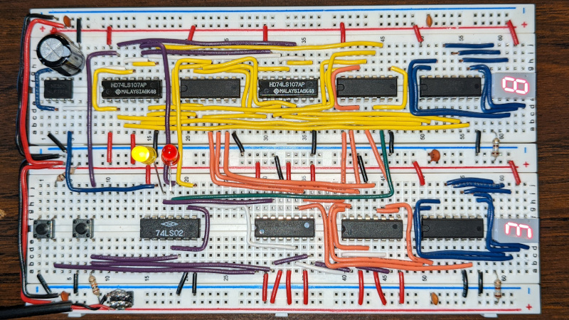
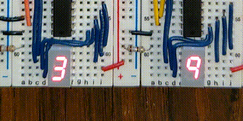

## Overview

This implementation of a BCD countdown timer was made in January 2022 during
PLTW Digital Electronics class.  Using two counters representing the tens
and ones digits respectively, and using BCD to seven segment display
converters, the circuit counts down from 60 to 0 in approximately 60 seconds.
Pause/resume and reset buttons are implemented into the timer.

The initial idea for this project came from the existence of the 60 Second
Timer project from PLTW.  The project heavily encouraged the use of
[Multisim](https://www.ni.com/en-us/shop/product/multisim.html) and the
[Diligent Cmod S6](https://digilent.com/reference/programmable-logic/cmod-s6/start)
FPGA board.  There were two main issues with regards to my personal goals
for the project:

1. The Cmod S6 development process was extremely slow.  I was unable to work on
   the project at all in my own time, as I was not able to use Multisim at home
   due to my heavy use of Linux.  In addition, uploads to the FPGA board took
   nearly two minutes, which was unacceptable for rapid prototyping.

2. The use of an FPGA board is ideal for prototyping, but it didn't challenge
   me as an engineer to use it as a final implementation.  Using discrete
   components and breadboards for the circuit implementation forced me to fully
   understand synchronous counter implementation from the ground up, learn how
   to effectively read datasheets for various components, account for strict
   space limitations, neatly arrange wires to aid in debugging, and debug the
   circuit in each stage of implementation.

At no point during the development process did I look at any implementations
for this problem, as they wouldn't have accounted for my specific space and
component limitations to begin with.  Some were based on self-imposed
challenges, and others were imposed based on the available components.
Restrictions included:

* Circuit space was restricted to two 800-pin breadboards.

* Use of explicit counter modules in the circuit was banned.

* Use of the following components was heavily restricted:
    * Two-input logic gates
    * Positive-edge-triggered D Flip-Flops

* Any component must have been available in the lab.

The circuit was prototyped and heavily optimized in
[Logisim Evolution](https://github.com/logisim-evolution/logisim-evolution).
After final optimizations, the project was implemented on breadboard.
A few components were added or modified to account for the lack of analog
functionality in Logisim.  The final breadboard implementation is shown below.

## Usage

Build the circuit described by the schematic in
`countdown_timer_kicad/countdown_timer_kicad.pdf`

Power the circuit using a 5V power supply.  Press the reset button to clear any
erroneous startup timer states.  Press the pause/resume button to start the
countdown.  If the circuit was built successfully, the timer should count down
in a similar to the following:

## References

All About Circuits.  (2017).  Asynchronous Counters.
<https://www.allaboutcircuits.com/textbook/digital/chpt-11/asynchronous-counters/>

Basic Electronics Tutorials.  (2018).  555 Oscillator Tutorial.
<https://www.electronics-tutorials.ws/waveforms/555_oscillator.html>

Basic Electronics Tutorials.  (2013).  Synchronous Counter.
<https://www.electronics-tutorials.ws/counter/count_3.html>

Texas Instruments.  (1988).  BCD-to-Seven-Segment Decoders/Drivers datasheet.
<https://www.ti.com/lit/ds/symlink/sn74ls47.pdf>

Texas Instruments.  (1988).  Dual J-K Flip-Flops With Preset And Clear
datasheet.  <https://www.ti.com/lit/ds/symlink/sn5476.pdf>

